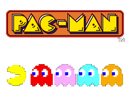

   
 

  

# Welcome to Pac-Man written in C# and running on Blazor WebAssembly

PLAY IT NOW!  <https://pacmanblazor2.azureedge.net/>

This is a project I started in order to experiment with Blazor/WebAssembly.  I wanted to see if it was feasible
to use Blazor to write a game in C# that runs at 60FPS.

## The answer is mostly YES

Although care was needed with heap allocations in the main game-loop (which has to take less than
16 milliseconds)

The game basically manipulates the HTML 5 canvas from C# code via the interop provided by Blazor.

# FAQ

## How does it interactive with the canvas?

It uses the .NET NuGet package [`Blazor.Extensions.Canvas`](https://www.nuget.org/packages/Blazor.Extensions.Canvas/)

## What are the dimensions of the canvas?

All drawing is done as on 224x314 canvas.  This is upscaled by 3x3 (672/944)
672/944 is a 0.711 aspect ratio

## How does sound work?

It uses [Howler](https://howlerjs.com/). `sound.js` is loaded and exposes `SoundPlayer`.  In the C# code, 
`GameSoundPlayer` loads the sound effects via `SoundLounder` which interact with Howler via [`IJSRuntime`](https://docs.microsoft.com/en-us/aspnet/core/blazor/call-javascript-from-dotnet?view=aspnetcore-3.1).  
Each sound in C# is represented by `SoundEffect` which again uses `IJSRuntime` to call methods on the JS `SoundPlayer`,
e.g. `_runtime.InvokeVoidAsync("soundPlayer.play", name])`.

When a sound has stopped playing, our `end` event on Howler calls back into the C# code.  
This is needed to loop things like the sirens and other long playing effects.

## How does touch / swipe / pan work?

It uses [Hammer.js](https://hammerjs.github.io/).  

# What happens when the game first starts?

First, we override `OnInitializedAsync` in `index.blazor` (which is the Blazor class that derives from `ComponentBase`).

In this method, we initialise the C# world and then call `setDrawCallback` in the JS code.  `setDrawCallback` does these things:

* initialises Hammer for input
* registers for `KeyDown`, `KeyUp` events on `window`;  the events are fed through to the C# code
* calls `requestAnimationFrame` on `window`;  every frame it then calls the C# code

Then, back in Blazor, we override `OnAfterRenderAsync` and initialise the canvases.  There are 3 canvases used, one is the output canvas that we draw on,
and the other two are canvases for each player's maze (it's a one or two player game).

# What happens when the game runs?

In JS, at startup, we called `requestAnimationFrame`. This means that every frame (60 per second), a JS method is called
and that method calls the C# code.  The C# code
